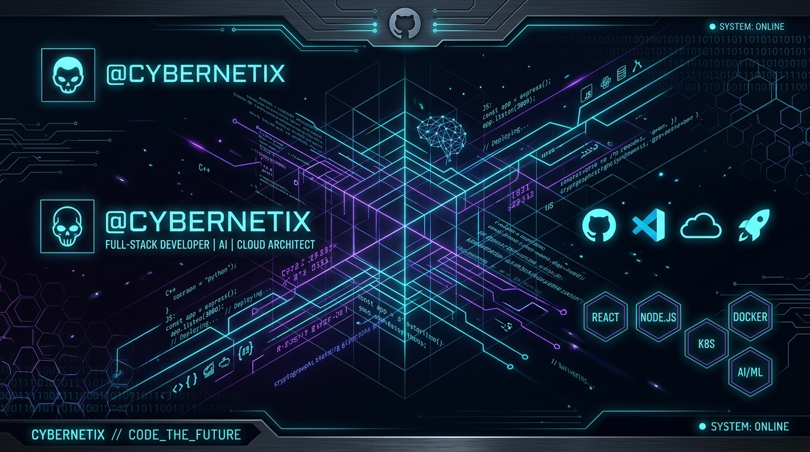

<div align="center">

  <!-- Aesthetic Header Banner -->
  

  <br/><br/>

  <!-- Typing Animation Title -->
  <a href="https://git.io/typing-svg">
    
  </a>

  <br/><br/>

  <!-- Quick Social Badges -->
  <a href="https://github.com/lakshya0-coder">
    
  </a>
  <a href="mailto:lakshyajangir5656@gmail.com">
    
  </a>
  <a href="https://linkedin.com">
    
  </a>

</div>

<br/>

---

### ⚡ // SYSTEM_INFO & ABOUT_ME

```gcode
root@lakshya0-coder:~# cat about_me.json
{
  "Developer": "Lakshya",
  "Handle": "lakshya0-coder",
  "Role": "Systems & Full-Stack Developer",
  "Focus": ["Low-Level Development", "Reverse Engineering", "High-Performance Backends"],
  "Status": "Building & Hacking 🚀",
  "Current_Goal": "Mastering Linux Kernel Architecture & Distributed Systems"
}
```

- 🔭 **Current Focus:** Building robust low-level tools, high-speed microservices, and slick web apps.
- ⚡ **Expertise:** Memory management, C/C++, Python, reverse engineering, web security, & Linux automation.
- 📬 **Reach Me:** `lakshyajangir5656@gmail.com`

<br/>

---

### 🛠️ // TECH_STACK & ARSENAL

<div align="center">

| Domain | Technologies & Tools |
| :--- | :--- |
| **Languages** |        |
| **Backend & Web** |     |
| **Security & Systems** |     |
| **DevOps & DB** |     |

</div>

<br/>

---

### 📊 // METRICS & METRICS_OVERVIEW

<div align="center">

  <!-- GitHub Stats Card -->
  
  
  <!-- Top Languages Card -->
  

</div>

<br/>

<div align="center">

  <!-- Streak Stats Card -->
  

</div>

<br/>

---

### 🏆 // GITHUB TROPHIES

<div align="center">
  
</div>

<br/>

---

### 📜 // QUOTE_OF_THE_DAY

<div align="center">

  

</div>

<br/>

<div align="center">
  <sub>Designed with ❤️ by cook45 & clack // SYSTEM_READY</sub>
</div>
